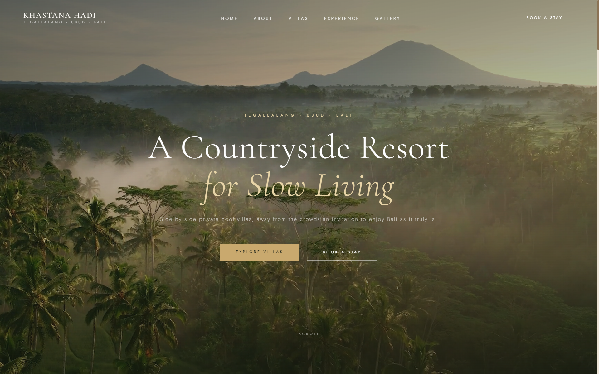

# Khastana Hadi Tegallalang Ubud
### A Countryside Resort for Slow Living — Official Website



---

## Struktur Folder

```
khastana-hadi-ubud-redesign/
├── index.html
├── README.md
│
├── css/
│   └── style.css
│
├── js/
│   └── script.js
│
├── video/
│   ├── hero-bg.mp4          ← video background hero (wajib)
│   └── gallery-villa.mp4    ← video item pertama di galeri (wajib)
│
└── images/
    ├── about.jpg            ← foto section About
    ├── villa-1.jpg          ← Luxe Countryside
    ├── villa-2.jpg          ← Cozy Countryside
    ├── villa-3.jpg          ← Rustic Countryside
    ├── experience-1.jpg     ← In-Villa Seafood Grill
    ├── experience-2.jpg     ← Balinese Massage
    ├── experience-3.jpg     ← Countryside Cooking Class
    ├── experience-4.jpg     ← Sunrise Mount Batur
    ├── gallery-1.jpg        ← Galeri foto 1
    ├── gallery-2.jpg        ← Galeri foto 2
    ├── gallery-3.jpg        ← Galeri foto 3
    └── cta.jpg              ← background section CTA
    └── website.png          ← Website design from scratch
```

---

## Cara Menjalankan

Cukup buka `index.html` di browser, atau gunakan live server (direkomendasikan):

```bash
# Menggunakan VS Code Live Server
# Klik kanan index.html → Open with Live Server
```

> **Catatan:** Website harus dijalankan melalui server (live server / localhost), bukan dibuka langsung sebagai file (`file://`). Video tidak akan berjalan jika dibuka langsung tanpa server.

---

## Menambahkan Aset

### Video Hero
Letakkan file video di folder `video/` dengan nama tepat:

| File | Format | Keterangan |
|---|---|---|
| `hero-bg.mp4` | MP4 H.264 | **Wajib** — video background hero |
| `gallery-villa.mp4` | MP4 H.264 | **Wajib** — video item pertama galeri |

### Gambar
Letakkan semua foto di folder `images/`. Format yang didukung: `.jpg`, `.webp`, `.png`.

**Rasio yang direkomendasikan per gambar:**

| File | Rasio | Keterangan |
|---|---|---|
| `about.jpg` | 959 x 959 (portrait) | Foto villa / suasana resort |
| `villa-1/2/3.jpg` | 1024 x 683 (landscape) | Foto masing-masing villa |
| `experience-1/2/3/4.jpg` | 1024 x 683 (landscape) | Foto experience card |
| `gallery-1/2/3.jpg` | 960 x 960 (portrait) | Foto galeri |
| `cta.jpg` | 1024 x 683 (landscape) | Foto panorama untuk CTA background |

---

## Fitur Website

| Fitur | Keterangan |
|---|---|
| **Video Hero** | Autoplay muted |
| **Auto Mute** | Suara otomatis mati saat scroll ke bawah atau pindah tab |
| **Sticky Nav** | Navbar transparan → solid saat scroll |
| **Mobile Menu** | Hamburger menu dengan overlay fullscreen |
| **Scroll Reveal** | Elemen muncul dengan animasi saat masuk viewport |
| **Gallery Lightbox** | Klik foto galeri untuk tampil fullscreen |
| **Gallery Video** | Video pertama galeri autoplay muted, polos saat hover |
| **Smooth Scroll** | Navigasi anchor link dengan animasi halus |
| **Responsive** | Mendukung mobile (≤600px), tablet (≤900px), desktop |

---

## Teknologi

- **HTML5** — semantic markup
- **CSS3** — custom properties, grid, flexbox, animasi
- **Vanilla JavaScript** — tanpa framework atau library eksternal
- **Google Fonts** — Cormorant Garamond (serif) + Jost (sans-serif)

---

## Browser Support

| Browser | Versi Minimum |
|---|---|
| Chrome | 88+ |
| Safari | 14+ |
| Firefox | 85+ |
| Edge | 88+ |

---

## Catatan Penting

**Suara video hero tidak bisa autoplay dengan suara**  ini adalah kebijakan wajib semua browser modern untuk mencegah website mengeluarkan suara tanpa izin user. Video akan selalu mulai dalam kondisi muted. User dapat mengaktifkan suara dengan mengklik video nya saja.

**File 404** — pastikan semua file gambar dan video sudah ditempatkan di folder yang benar sesuai struktur di atas sebelum deploy.

---